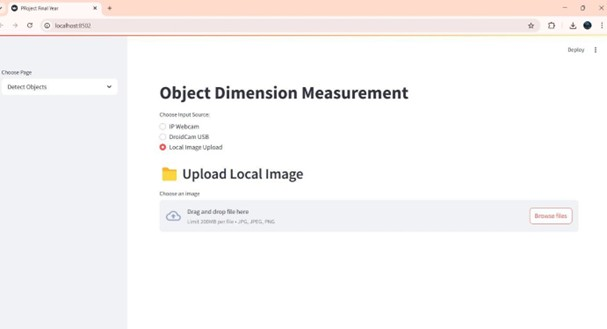
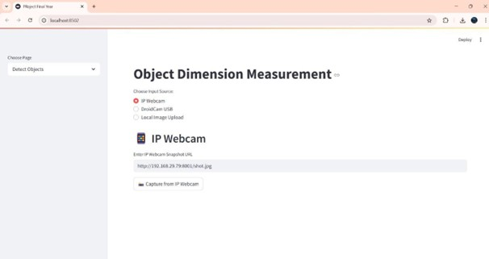
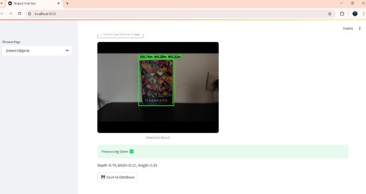
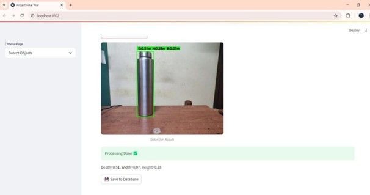
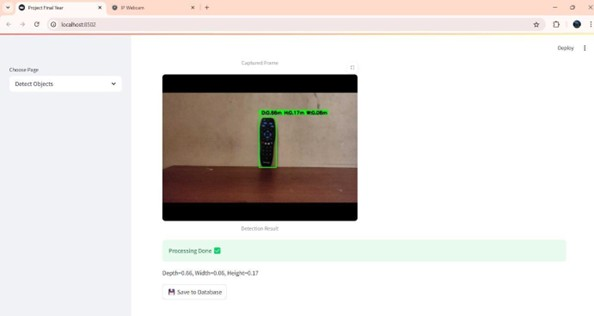
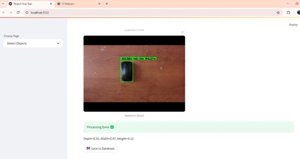
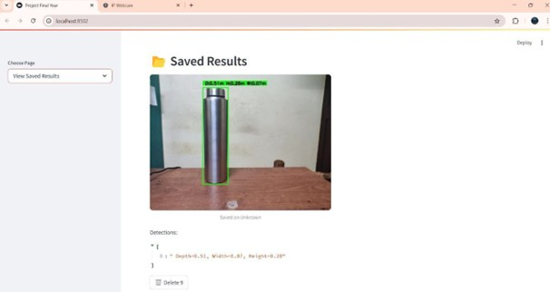

# 📏 Real-Time Object Dimension Measurement System

A **Computer Vision based system** that measures the **real-world
dimensions of objects in real time using a camera**. This project uses
**OpenCV and image processing techniques** to detect objects and
estimate their width and height directly from images or live webcam
input.

The system demonstrates how **image processing, object detection, and
pixel-to-real-world scaling** can be used to automatically measure
object dimensions.

------------------------------------------------------------------------

# 🚀 Project Overview

Estimating the size of real-world objects using a camera is useful in
many industries such as:

-   📦 Logistics
-   🏭 Manufacturing
-   🤖 Robotics
-   🛒 E‑commerce
-   📏 Automated inspection systems

This project provides a **lightweight and efficient solution** that
detects objects and calculates their **dimensions in real time** using
computer vision.

------------------------------------------------------------------------

# ✨ Key Features

✔ Real-time object detection using webcam\
✔ Automatic edge and contour detection\
✔ Width and height measurement of objects\
✔ Pixel-to-real-world conversion for accurate measurement\
✔ Bounding box visualization\
✔ Works with both **images and live camera feed**

------------------------------------------------------------------------

# 🧠 How the System Works

The system follows a computer vision pipeline:

1.  **Image Capture** -- Capture input frame from camera or image.
2.  **Image Preprocessing** -- Convert image to grayscale and remove
    noise.
3.  **Edge Detection** -- Detect object edges using OpenCV.
4.  **Contour Detection** -- Extract contours to find object boundaries.
5.  **Reference Calibration** -- Calculate pixels-per-metric ratio.
6.  **Dimension Calculation** -- Measure width and height of objects.
7.  **Visualization** -- Display measurements directly on the screen.

------------------------------------------------------------------------

# 🛠 Tech Stack

### Programming Language

-   Python

### Libraries

-   OpenCV
-   NumPy
-   imutils

### Tools

-   Webcam / Camera
-   VS Code / PyCharm
-   Git & GitHub

------------------------------------------------------------------------

# 📂 Project Structure

    Real-time-Object-Dimension-Measument-System
    │
    ├── measure_object_size.py
    ├── measure_object_size_camera.py
    ├── object_detector.py
    ├── images/
    │   └── sample images
    ├── Outputs/
    │   ├── Picture1.jpg
    │   ├── Picture2.jpg
    │   ├── Picture3.jpg
    │   ├── Picture4.jpg
    │   ├── Picture5.jpg
    │   ├── Picture6.jpg
    │   └── Picture7.jpg
    └── README.md

------------------------------------------------------------------------

# ⚙️ Installation

### Clone the Repository

``` bash
git clone https://github.com/UmeshNayak1/Real-time-Object-Dimension-Measument-System-.git
```

### Navigate to Project Folder

``` bash
cd Real-time-Object-Dimension-Measument-System-
```

### Install Dependencies

``` bash
pip install opencv-python numpy imutils
```

------------------------------------------------------------------------

# ▶️ Usage

### Run with Webcam

``` bash
python measure_object_size_camera.py
```

### Run with Image

``` bash
python measure_object_size.py
```

The system will detect objects and display **width and height
measurements** on the screen.

------------------------------------------------------------------------

# 📸 Project Outputs

## Fig 1 -- Home Page to Upload Local Images

Users can upload local images to detect objects and measure their
dimensions.



------------------------------------------------------------------------

## Fig 2 -- Home Page to Upload from IP Webcam (Real-time)

The system supports real-time object measurement using an IP webcam.



------------------------------------------------------------------------

## Fig 3 -- Detected Objects from Local Image Testing (Book)

The system detects a book and calculates its dimensions.



------------------------------------------------------------------------

## Fig 4 -- Detected Objects from Local Image Testing (Bottle)

Object detection and measurement applied to a bottle.



------------------------------------------------------------------------

## Fig 5 -- Detected Objects from Real-time Images Testing (Remote)

The system measures object dimensions using live camera feed.



------------------------------------------------------------------------

## Fig 6 -- Detected Objects from Real-time Images (Mouse)

Real-time detection and dimension measurement of a mouse device.



------------------------------------------------------------------------

## Fig 7 -- Saved Result in Database

Detected measurements are saved into the database for future reference.



------------------------------------------------------------------------

# 📊 Applications

-   📦 Product dimension measurement for e‑commerce
-   🏭 Industrial quality control
-   🤖 Robotics and automation
-   🚚 Logistics and packaging systems
-   🎓 Computer vision research and education

------------------------------------------------------------------------

# 🔮 Future Improvements

-   Improve measurement accuracy using calibration
-   Integrate **deep learning object detection (YOLO)**
-   Support multiple object measurement
-   Build a **GUI interface**
-   Convert the system into a **web application**

------------------------------------------------------------------------
